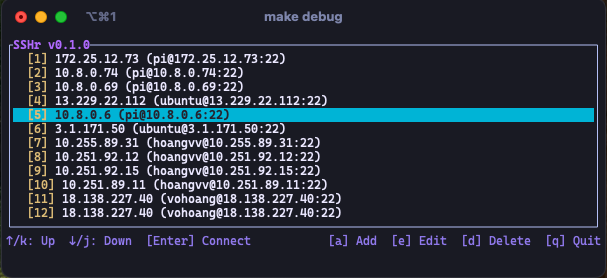

# SSHR

- SSHR là một ứng dụng TUI (Text User Interface) để quản lý và kết nối với các máy chủ thông qua giao diện terminal.
- Hiện tại chỉ hỗ trợ macOS và Linux (x86_64)

[](https://github.com/hoangneeee/sshr/actions/workflows/release.yml)

## UI



## Get started

- `sshr` sẽ đọc file host từ ~/.ssh/config

## Cài đặt

### Sử dụng Homebrew (khuyên dùng)

```bash
# Thêm tap của bạn (chỉ cần chạy lần đầu)
brew tap hoangneeee/homebrew-tap

# Cài đặt
brew install sshr
```

### Cài đặt từ release

```bash
curl -L -O https://github.com/hoangneeee/sshr/releases/download/v0.1.0/sshr-x86_64-apple-darwin.tar.gz
# or
wget https://github.com/hoangneeee/sshr/releases/download/v0.1.0/sshr-x86_64-apple-darwin.tar.gz

# Unzip
tar -xvf sshr-x86_64-apple-darwin.tar.gz

# Copy to /usr/local/bin
sudo cp sshr-x86_64-apple-darwin/sshr /usr/local/bin/sshr
```

### For Developer

```bash
git clone https://github.com/hoangneeee/sshr.git

cd sshr

make install
```

## Available flags

| Flag        | Short flag | Description             |
| ----------- | ---------- | ----------------------- |
| `--version` | `-V`       | Current version of sshr |
| `--help`    | `-h`       | Show help               |

## Contribute

- Nếu bạn muốn đóng góp vào dự án này, hãy fork repository này và tạo pull request.
- Nếu bạn muốn báo lỗi hoặc đề xuất cải tiến, hãy tạo issue.
