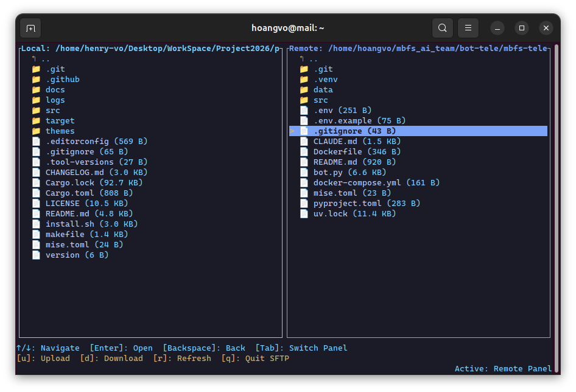

# 💻 SSHR

SSHR is a TUI (Text User Interface) application for managing and connecting to hosts through the terminal interface.

[](https://github.com/hoangneeee/sshr/actions/workflows/release.yml)

🎯 Supports: macOS & Linux (x86_64)

---

## 📚 Contents

- [UI Preview](#ui-preview)
- [Quick Start](#quick-start)
- [Installation](#installation)
- [Theme Configuration](#theme-configuration)
- [Available Flags](#available-flags)
- [Keyboard Shortcuts](./docs/keyboard_shortcuts.md)
- [Contribute](#contribute)
- [License](#license)

---

## 🖥️ UI Preview



## 🚀 Quick Start

- `sshr` automatically load hosts from your ~/.ssh/config
- Load customer host file with `hosts.toml` and template file [hosts.toml](./docs/hosts.toml)

## 📦 Installation

### 🍺 Install using Homebrew (recommended)

```bash
brew tap hoangneeee/sshr
brew install sshr
```

### 🐧 Install on Linux / macOS via curl

```bash
curl -fsSL https://raw.githubusercontent.com/hoangneeee/sshr/master/install.sh | bash
```

The script auto-detects your OS/arch and installs the binary to `/usr/local/bin`.
Override with environment variables if needed:

```bash
# Pin a specific version
curl -fsSL https://raw.githubusercontent.com/hoangneeee/sshr/master/install.sh | VERSION=v0.10.4 bash

# Install to your home dir (no sudo)
curl -fsSL https://raw.githubusercontent.com/hoangneeee/sshr/master/install.sh | INSTALL_DIR=$HOME/.local/bin bash
```

### ⬇️ Install from release

Pick the asset that matches your platform:

- Linux x86_64 → `sshr-x86_64-unknown-linux-gnu.tar.gz`
- macOS Intel → `sshr-x86_64-apple-darwin.tar.gz`
- macOS Apple Silicon → `sshr-aarch64-apple-darwin.tar.gz`

```bash
# Example: macOS Apple Silicon
curl -LO https://github.com/hoangneeee/sshr/releases/download/latest/sshr-aarch64-apple-darwin.tar.gz

# Extract — the archive contains a single `sshr` binary at the root
tar -xvf sshr-aarch64-apple-darwin.tar.gz

# Install
sudo install -m 0755 sshr /usr/local/bin/sshr
```

### 🔨 For Developer

```bash
git clone https://github.com/hoangneeee/sshr.git

cd sshr

make install
```

## 🎨 Theme Configuration

`sshr` reads its config from `~/.config/sshr/sshr.toml` (created with defaults on first run). You can define multiple themes and pick the active one via `default_theme`.

### Color roles

Each theme defines 8 color roles. Colors are 6-digit hex strings (the leading `#` is optional). Invalid or missing values fall back to sensible defaults.

| Key          | Used for                                      | Default     |
| ------------ | --------------------------------------------- | ----------- |
| `primary`    | Active panel border, selected row, success    | `#50fa7b`   |
| `secondary`  | Info text, secondary labels                   | `#8be9fd`   |
| `highlight`  | Search prompt, accent highlights              | `#f1fa8c`   |
| `text`       | Normal text                                   | `#f8f8f2`   |
| `error`      | Errors, fuzzy-match character highlight       | `#ff5555`   |
| `warning`    | Reserved for future use                       | `#ffb86c`   |
| `success`    | Success status messages                       | `#50fa7b`   |
| `background` | Reserved (terminal background is not painted) | `#1a202c`   |

### Example: add a Tokyo Night theme

```toml
# ~/.config/sshr/sshr.toml

default_theme = "tokyo-night"
ssh_file_config = "/home/you/.ssh/config"
strict_host_key_checking = "accept-new"

[[themes]]
name = "default"
[themes.colors]
primary    = "#50fa7b"
secondary  = "#8be9fd"
background = "#1a202c"
text       = "#f8f8f2"
highlight  = "#f1fa8c"
error      = "#ff5555"
warning    = "#ffb86c"
success    = "#50fa7b"

[[themes]]
name = "tokyo-night"
[themes.colors]
primary    = "#7aa2f7"
secondary  = "#7dcfff"
background = "#1a1b26"
text       = "#c0caf5"
highlight  = "#e0af68"
error      = "#f7768e"
warning    = "#ff9e64"
success    = "#9ece6a"
```

To switch themes, change `default_theme` to the `name` of any theme defined under `[[themes]]` and restart `sshr`. If `default_theme` doesn't match any theme, the first one in the list is used.

## 📝 Available flags

| Flag        | Short flag | Description             |
| ----------- | ---------- | ----------------------- |
| `--version` | `-V`       | Current version of sshr |
| `--help`    | `-h`       | Show help               |

## 🤝 Contribute

- If you want to contribute to this project, please fork this repository and create a pull request.
- If you want to report an issue or suggest an improvement, please create an issue.


## 📝 License

[Apache License 2.0](./LICENSE)
